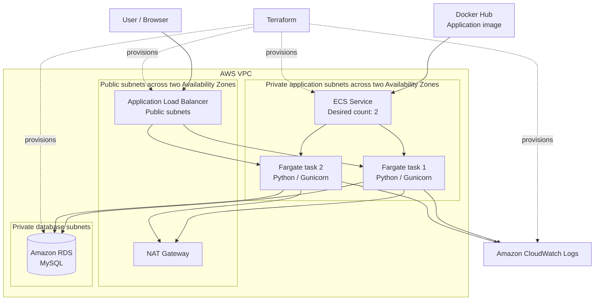

<a href="https://www.linkedin.com/in/vincent-lucas-483b29295/" target="_blank">LinkedIn</a>

# Highly Available Support Desk on AWS

A small production-style support ticket web application deployed on AWS with containerized compute, load balancing, private networking, and a relational database.

The project was built as a hands-on cloud engineering exercise: package a Python web application with Docker, publish the image, provision reproducible AWS infrastructure with Terraform, deploy the application on Amazon ECS Fargate, validate database persistence end to end, inspect centralized logs, and remove the environment cleanly afterwards.

> The AWS infrastructure is intentionally destroyed after validation to avoid unnecessary cloud costs. The repository contains the full Terraform configuration, application source code, container definition, and deployment evidence.

## What it does

The application provides a minimal support-desk workflow.

- Create a support ticket with an author, title, and description.
- Store ticket data in Amazon RDS for MySQL.
- Display previously created tickets.
- Confirm data persistence by showing tickets after a page refresh.
- Expose a `/health` endpoint used by the Application Load Balancer health checks.

Each ticket contains:

```text
id
author
title
description
status
created_at
```

## Architecture

```text
Internet
  |
  v
Application Load Balancer
  |
  v
Amazon ECS Service
  |
  +--> Fargate task 1 (Python web application)
  |
  +--> Fargate task 2 (Python web application)
  |
  v
Amazon RDS for MySQL
```



## AWS services and tools

| Technology | Purpose |
|---|---|
| Amazon VPC | Provides isolated networking, public and private subnets, route tables, and security boundaries. |
| Application Load Balancer | Exposes the application publicly and routes requests only to healthy ECS tasks. |
| Amazon ECS | Orchestrates the containerized application service. |
| AWS Fargate | Runs application containers without managing EC2 instances. |
| Amazon RDS for MySQL | Stores support tickets in a managed relational database. |
| Amazon ECR / Docker Hub | Hosts the container image used by the ECS task definition. |
| Amazon CloudWatch Logs | Collects container and application logs centrally. |
| AWS Security Groups | Restricts traffic between the load balancer, application containers, and database. |
| Terraform | Defines and provisions the infrastructure as code. |
| Docker | Packages the Python application into a portable container image. |
| Python | Implements the web application and database interactions. |
| Flask | Provides the lightweight web application framework. |
| Gunicorn | Runs the Python application in the Fargate containers. |
| MySQL | Provides the relational data model for support tickets. |

## Security model

The application uses separate security groups for each tier.

| Source | Destination | Port | Purpose |
|---|---|---:|---|
| Internet | Application Load Balancer | 80 | Public HTTP access to the web application. |
| ALB security group | ECS task security group | 5000 | Allows the load balancer to forward requests to the Python application. |
| ECS task security group | RDS security group | 3306 | Allows only the application containers to access MySQL. |

The database is deployed in private subnets and is not intended to be publicly accessible. The Application Load Balancer is the only public entry point.

## Engineering decisions

### Containerized application deployment

The application is packaged as a Docker image and run through ECS Fargate. This separates the application runtime from the underlying infrastructure and avoids server administration for the compute layer.

### Two running application tasks

The ECS service maintains a desired count of two Fargate tasks. The Application Load Balancer distributes requests across healthy tasks, reducing the impact of an individual task failure.

### Health checks and traffic routing

The ALB checks the `/health` endpoint before routing traffic to a task. Unhealthy targets are removed from load balancing until they recover or ECS replaces them.

### Private application and database tiers

ECS tasks and RDS are placed in private subnets. Only the ALB receives inbound traffic from the internet, while security groups enforce the allowed path between tiers.

### Persistent relational storage

Support tickets are written to Amazon RDS for MySQL rather than stored in container memory. This means application tasks can be restarted or replaced without losing ticket data.

### Centralized observability

ECS task logs are sent to CloudWatch Logs. The application logs include successful ticket creation, HTTP requests, and ALB health check activity.

### Reproducible infrastructure

Terraform declares the networking, security groups, ALB, ECS service, task definition, CloudWatch logging, and RDS database. A subsequent `terraform plan` reporting no changes confirms that the deployed state matches the declared configuration.

## Project structure

```text
.
├── app/
│   ├── app.py                    # Flask application and ticket workflow
│   ├── migrate.py                # MySQL schema initialization
│   ├── requirements.txt          # Python dependencies
│   ├── Dockerfile                # Container image definition
│   └── templates/
│       └── index.html            # Support Desk user interface
├── terraform/
│   ├── main.tf                   # Terraform entry point
│   ├── providers.tf              # Terraform and AWS provider configuration
│   ├── variables.tf              # Input variables
│   ├── outputs.tf                # ALB DNS and infrastructure outputs
│   ├── vpc.tf                    # VPC, subnets, routing, NAT Gateway
│   ├── security_groups.tf        # ALB, ECS, and RDS security groups
│   ├── alb.tf                    # ALB, listener, target group, health check
│   ├── ecs.tf                    # ECS cluster, task definition, service
│   ├── rds.tf                    # RDS MySQL database and subnet group
│   ├── cloudwatch.tf             # CloudWatch log group
│   └── .terraform.lock.hcl       # Locked provider versions
├── resources/                    # Deployment and validation screenshots
│   ├── ecs-service-healthy-3.jpg
│   ├── alb-targets-healthy-2.jpg
│   ├── ticket-creation-5.jpg
│   ├── ticket_open-4.jpg
│   ├── cloudwatch-logs.jpg
│   └── terraform-plan-terminal-6.jpg
├── .gitignore
└── README.md
```

## Local development

### Prerequisites

- Docker
- Python 3.12 or newer
- Terraform
- AWS CLI configured with credentials for the target AWS account
- Access to a MySQL database, locally or in AWS

Build the application image locally:

```bash
cd app
docker build -t support-desk:local .
```

Run the container locally with database environment variables:

```bash
docker run --rm -p 5000:5000 \
  -e DB_HOST="<mysql-host>" \
  -e DB_NAME="<database-name>" \
  -e DB_USER="<database-user>" \
  -e DB_PASSWORD="<database-password>" \
  support-desk:local
```

Open the application at:

```text
http://localhost:5000
```

## Deploy with Terraform

From the `terraform/` directory:

```bash
terraform init
terraform fmt
terraform validate
terraform plan
terraform apply
```

After deployment, retrieve the public Application Load Balancer address:

```bash
terraform output
```

Open the ALB DNS name in a browser to access the Support Desk application.

The `.terraform.lock.hcl` file is versioned to keep provider selection reproducible. Local Terraform state files and the `.terraform/` directory should remain excluded from Git.

## Validation evidence

### ECS service health

The ECS service is active with a desired count of two tasks, two running tasks, zero pending tasks, and a successful deployment.


### Healthy load balancer targets

The Application Load Balancer target group reports two healthy IP targets on application port `5000`. This confirms that the ALB health checks can reach both Fargate tasks.


### Ticket creation through the public ALB

The Support Desk is reachable through the public ALB DNS name, and a ticket can be submitted through the web interface.


### Database persistence after refresh

A created ticket remains visible after a browser refresh, demonstrating that ticket data is stored in MySQL rather than only held in the container process.


### CloudWatch application logs

CloudWatch Logs records ALB health checks and the successful `ticket_created` application event. This provides operational visibility into application behavior running on ECS.


### Terraform convergence

After deployment, Terraform reports no changes. The live AWS infrastructure matches the Terraform configuration.


## Cleanup

This environment includes chargeable AWS resources, including the Application Load Balancer, Fargate tasks, RDS instance, and NAT Gateway.

To remove all Terraform-managed resources:

```bash
cd terraform
terraform plan -destroy
terraform destroy
```

Review the destroy plan carefully before confirming. The Terraform code, Docker image definition, and deployment evidence remain available in the repository and can be used to recreate the environment later.

## Skills demonstrated

This project demonstrates practical Cloud Engineer skills in:

- Designing a three-tier AWS architecture with a public ingress tier, private containerized application tier, and private database tier.
- Provisioning cloud infrastructure reproducibly with Terraform.
- Building and deploying Dockerized Python applications.
- Operating container workloads with Amazon ECS and AWS Fargate.
- Configuring Application Load Balancers, target groups, listeners, and health checks.
- Applying network segmentation with VPCs, public/private subnets, route tables, NAT Gateway, and security groups.
- Controlling database access through security-group-to-security-group rules.
- Connecting application containers securely to Amazon RDS for MySQL.
- Implementing application health endpoints and operational logging.
- Diagnosing and validating cloud deployments using ECS, ALB target health, CloudWatch Logs, and Terraform plans.
- Managing cloud costs by destroying non-production resources after validation.

The project builds on a software engineering background that includes Python development, Flask applications, Linux-based systems, databases, distributed systems, embedded software, and end-to-end delivery.

## Possible next steps

- Move the container image from Docker Hub to Amazon ECR.
- Store database credentials in AWS Secrets Manager instead of task-definition environment variables.
- Add RDS Multi-AZ deployment and automated backups for stronger database resilience.
- Add ECS Service Auto Scaling based on CPU utilisation, memory utilisation, or ALB request count.
- Add HTTPS through AWS Certificate Manager and an ALB HTTPS listener.
- Add a custom domain through Amazon Route 53.
- Add CloudWatch metrics, alarms, and a dashboard for task CPU, memory, request latency, target health, and database connections.
- Add a CI/CD pipeline with GitHub Actions to build the Docker image, run tests, validate Terraform, and deploy changes.
- Use an S3 remote backend and DynamoDB locking for Terraform state management.
- Add automated unit and integration tests for the Flask application.
- Add AWS WAF rules and rate limiting at the public ingress layer.

## Contact

- LinkedIn: [Vincent Lucas](https://www.linkedin.com/in/vincent-lucas-483b29295/)
- GitHub: [@vinsl](https://github.com/vinsl)
- Email: [vincentselucas@gmail.com](mailto:vincentselucas@gmail.com)