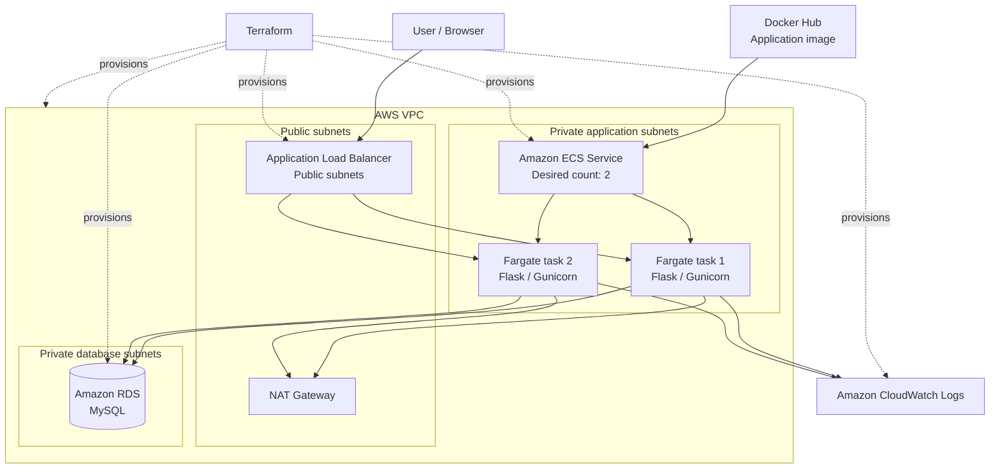
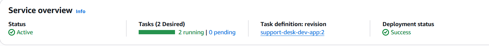
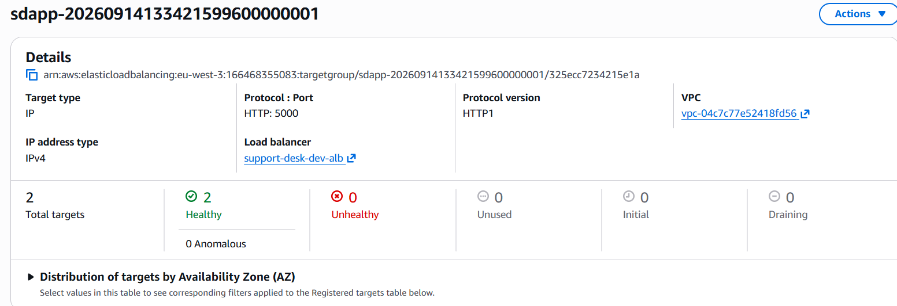
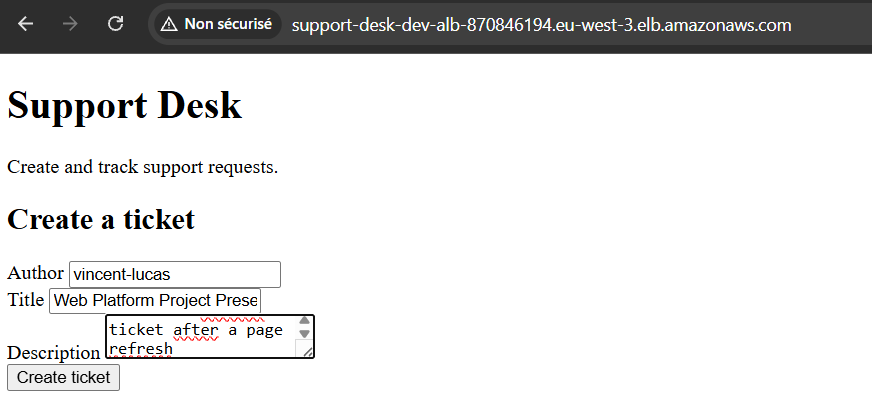
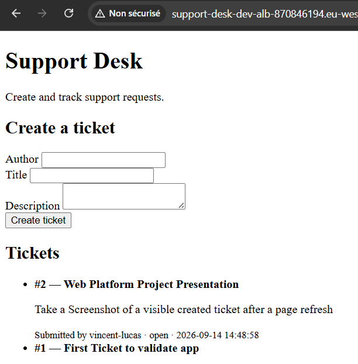
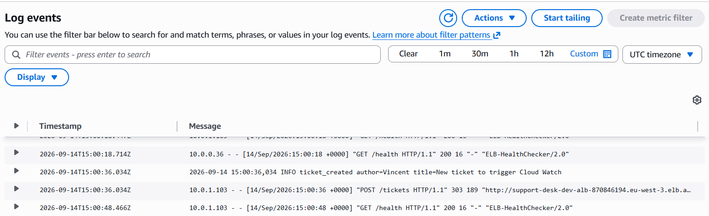
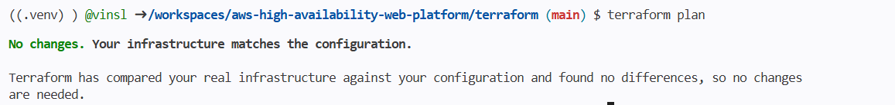

<a href="https://www.linkedin.com/in/vincent-lucas-483b29295/" target="_blank">LinkedIn</a>

# Highly Available Support Desk on AWS

A production-style support ticket web application deployed on AWS with Docker, Terraform, Amazon ECS Fargate, an Application Load Balancer, and Amazon RDS for MySQL.

This project was built as a hands-on Cloud Engineering exercise: develop and test a Python application locally, package it into a Docker image, provision modular AWS infrastructure with Terraform, deploy two application tasks on ECS Fargate, validate end-to-end persistence in MySQL, inspect CloudWatch logs, and destroy the environment after validation.

> The AWS infrastructure is intentionally destroyed after validation to avoid unnecessary costs. The repository keeps the complete application source code, automated tests, Docker configuration, Terraform modules, and deployment evidence so the environment can be recreated.

## What it does

The Support Desk provides a simple ticket workflow.

- Create a ticket with an author, title, and description.
- Store tickets in Amazon RDS for MySQL.
- Display submitted tickets in the web interface.
- Keep tickets available after a page refresh.
- Expose a `/health` endpoint for load balancer health checks.

Each ticket includes:

```text
id
author
title
description
status
created_at
```

## Architecture

```text
User
  |
  v
Application Load Balancer
  |
  v
ECS Service
  |
  +--> Fargate task 1
  |
  +--> Fargate task 2
  |
  v
RDS MySQL
```



## Technologies

| Technology | Purpose |
|---|---|
| Amazon VPC | Provides isolated networking with public and private subnets. |
| NAT Gateway | Lets tasks in private subnets access external services without becoming publicly reachable. |
| Application Load Balancer | Public entry point that routes traffic to healthy application tasks. |
| Amazon ECS | Orchestrates the containerized Support Desk service. |
| AWS Fargate | Runs containers without managing EC2 instances. |
| Amazon RDS for MySQL | Stores persistent ticket data. |
| Amazon CloudWatch Logs | Collects application and container logs. |
| AWS Security Groups | Restrict traffic between the load balancer, ECS tasks, and database. |
| Terraform | Provisions infrastructure through reusable modules. |
| Docker and Docker Compose | Package and run the application consistently in local and cloud environments. |
| Python / Flask | Implements the Support Desk application. |
| Gunicorn | Runs the Flask application in the container. |
| Pytest | Tests the health endpoint, application rendering, and ticket workflow. |

## Network and security

The architecture separates public access, application compute, and persistent data.

| Source | Destination | Port | Purpose |
|---|---|---:|---|
| Internet | Application Load Balancer | 80 | Public HTTP access. |
| ALB security group | ECS task security group | 5000 | Forwards requests to the Flask application. |
| ECS task security group | RDS security group | 3306 | Allows MySQL access only from the application tier. |

Only the Application Load Balancer accepts inbound traffic from the internet. ECS tasks and RDS are placed in private subnets, while security groups enforce the allowed traffic path.

## Engineering decisions

### Modular Terraform

Infrastructure is split into focused modules for networking, security, load balancing, ECS, database, and compute configuration. This improves readability, reuse, and maintenance compared with placing every resource in one Terraform file.

### Containerized Python application

The Flask application is packaged with Docker. The same container definition supports local development through Docker Compose and cloud deployment through ECS Fargate.

### Two application tasks behind an ALB

The ECS service maintains two running Fargate tasks. The ALB distributes incoming requests only to targets that pass the configured health checks.

### Health endpoint

The application exposes `/health`, allowing the ALB to check task availability independently of the user-facing ticket page.

### Persistent MySQL storage

Ticket creation writes data to RDS MySQL, while the application reads existing tickets back from the database. Data therefore persists independently from the lifecycle of individual containers.

### Centralized application logs

The application emits operational logs to CloudWatch, including successful health checks and ticket creation events.

### Testable application behavior

The repository contains Pytest tests for the health endpoint, page behavior, and ticket workflow. This gives the application a local verification layer before deployment.

## Project structure

```text
.
├── app/
│   ├── app.py                         # Flask routes and ticket workflow
│   ├── db.py                          # Database connection and query helpers
│   ├── migrate.py                     # Database migration runner
│   ├── requirements.txt               # Python dependencies
│   ├── Dockerfile                     # Application container definition
│   ├── docker-compose.yml             # Local application and database environment
│   ├── db/
│   │   └── 001_create_tickets.sql     # MySQL tickets table schema
│   ├── templates/
│   │   └── index.html                 # Support Desk interface
│   └── test/
│       ├── test_health.py             # Health endpoint tests
│       ├── test_index.py              # Index page tests
│       └── test_tickets.py            # Ticket workflow tests
├── terraform/
│   ├── main.tf                        # Root module composition
│   ├── providers.tf                   # Terraform and AWS provider configuration
│   ├── variables.tf                   # Root input variables
│   ├── outputs.tf                     # Infrastructure outputs
│   ├── terraform.tfvars.example       # Example variable values
│   ├── .terraform.lock.hcl            # Locked provider versions
│   └── modules/
│       ├── network/                   # VPC, subnets, routes, NAT Gateway
│       ├── security/                  # ALB, ECS, and RDS security groups
│       ├── load_balancer/             # ALB, listener, target group, health checks
│       ├── ecs/                       # ECS cluster, task definition, service
│       ├── database/                  # RDS MySQL and database subnet group
│       └── compute/                   # Shared compute-related configuration
├── resources/
│   ├── ecs-service-healthy.png
│   ├── alb-targets-healthy.png
│   ├── ticket-creation.png
│   ├── ticket_open.png
│   ├── cloudwatch-logs.png
│   └── terraform-plan-terminal.png
├── .devcontainer/
│   ├── Dockerfile
│   └── devcontainer.json
├── LICENSE
└── README.md
```

## Run locally

### Prerequisites

- Docker and Docker Compose
- Python 3.12 or newer
- Terraform
- AWS CLI configured for the target AWS account

Start the local application stack:

```bash
cd app
docker compose up --build
```

Open the application:

```text
http://localhost:5000
```

Stop the local stack:

```bash
docker compose down
```

## Run tests

From the repository root, activate your Python environment and install dependencies:

```bash
python -m pip install -r app/requirements.txt
```

Run the test suite:

```bash
python -m pytest app/test -v
```

## Deploy with Terraform

Create your local Terraform variables file from the tracked example:

```bash
cd terraform
cp terraform.tfvars.example terraform.tfvars
```

Update `terraform.tfvars` with the values required for your AWS deployment. Do not commit this file if it contains sensitive values.

Initialize and validate the configuration:

```bash
terraform init
terraform fmt -recursive
terraform validate
terraform plan
```

Deploy the infrastructure:

```bash
terraform apply
```

After a successful deployment, Terraform outputs the information needed to access the application.

## Validation evidence

### ECS service is stable

The ECS service is active with a desired count of two tasks, two tasks running, no pending tasks, and a successful deployment.



### ALB routes to healthy tasks

The ALB target group reports two healthy IP targets on port `5000`, confirming that both Fargate tasks pass the health checks.



### Ticket creation through the ALB

The application is reachable through the public load balancer and accepts ticket submissions through its web interface.



### Ticket data persists in MySQL

A submitted ticket remains visible after refreshing the page, demonstrating a successful write and read through RDS MySQL.



### Centralized CloudWatch logs

CloudWatch records ALB health checks and application-level ticket creation events.



### Terraform convergence

After deployment, Terraform reports no changes, confirming that the deployed AWS resources match the declared configuration.



## Cleanup

The deployed stack includes chargeable AWS resources, including Fargate tasks, an ALB, an RDS instance, and a NAT Gateway.

Destroy all resources tracked by Terraform:

```bash
cd terraform
terraform plan -destroy
terraform destroy
```

Review the destruction plan before confirming. The application code, Docker configuration, Terraform modules, tests, and validation evidence remain in the repository and can recreate the environment later.

## Skills demonstrated

- Infrastructure as Code with modular Terraform.
- Docker image creation and local orchestration with Docker Compose.
- Python and Flask web application development.
- Automated testing with Pytest.
- AWS networking with VPCs, public/private subnets, routing, NAT Gateway, and security groups.
- Container orchestration with Amazon ECS and AWS Fargate.
- Application Load Balancer configuration, target groups, and health checks.
- Amazon RDS MySQL integration and persistent application data.
- CloudWatch Logs for operational visibility.
- Deployment validation through ECS service status, target health, application behavior, logs, and Terraform convergence.
- Cost-aware infrastructure cleanup with Terraform.

## Possible next steps

- Store database credentials in AWS Secrets Manager.
- Move the application image from Docker Hub to Amazon ECR.
- Add HTTPS with AWS Certificate Manager and an ALB HTTPS listener.
- Add ECS Service Auto Scaling based on CPU, memory, or ALB request count.
- Configure RDS Multi-AZ, backups, and monitoring.
- Add GitHub Actions for Pytest, Docker builds, Terraform formatting, validation, and deployment.
- Use an S3 remote Terraform backend with DynamoDB state locking.
- Add CloudWatch alarms and dashboards.
- Add authentication, authorization, and AWS WAF protection.

## Contact

- LinkedIn: [Vincent Lucas](https://www.linkedin.com/in/vincent-lucas-483b29295/)
- GitHub: [@vinsl](https://github.com/vinsl)
- Email: [vincentselucas@gmail.com](mailto:vincentselucas@gmail.com)